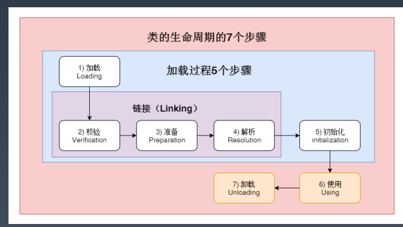
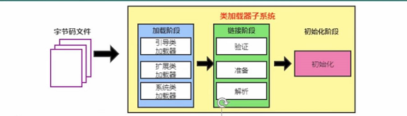

# 类的生命周期

# 过程
## 加载（load）
1. 通过一个类的全限定名来获取定义此类的二进制字节流；
2. 将这个字节流所代表的静态存储结构转化为方法区的运行时数据结构；
3. 在内存中生成一个代表这个类的java.lang.Class对象，作为方法区这个类的各种数据的访问入口。
## 链接(Linking)
### 校验
目的是在于确保class文件的字节流中包含信息符合当前虚拟机要求，保证被加载类的正确性，不会危害虚拟机自身安全。 
主要包括四种验证： 文件格式验证、元数据验证、字节码验证、符号引用验证。
### 准备
为类变量分配内存并且设置该类变量的默认初始值，即零值。
### 解析
虚拟机将常量池内的符号引用替换为直接引用的过程。
## 初始化
真正开始执行类中定义的Java程序代码(或者说是字节码)； 
根据程序员通过程序制定的主观计划去初始化类变量和其他资源。换个角度来说，初始化阶段是执行类构造器<clinit>()方法的过程。

### 初始化时机：
虚拟机规范规定了有且只有5中情况下，必须立即对类进行初始化，称为对一个类进行主动引用；
1. 遇到new、getstatic、putstatic 或invokestatic 这四条字节码指令时，如果类没有进行过初始化，则需要先触发其初始化。
场景： 使用new关键字实例化对象的时候、读取或设置一个类的静态字段(被final修饰，已在编译器把结果放入常量池的静态字段除外)的时候，以及调用一个类的静态方法的时候，
2. 使用java.lang.reflect 包的方法对类进行反射调用的时候，如果类没有进行过初始化，则需要先触发其初始化
3. 当虚拟机启动时，用户需要指定一个要执行的主类(包含main()方法的那个类),虚拟机会先初始化这个主类；
4. 当初始化一个类时，如果发现其父类还没有进行过初始化，则需要先触发其父类的初始化；
如果初始化的是一个接口，并不要求其父接口全部都完成了初始化，只有在真正使用到父接口的时候，才会初始化。比如(引用接口中定义的常量)
5. 当使用JDK 1.7 的动态语言支持时，如果一个java.lang.invoke.MethodHandle实例最后的解析结果REF_getStatic、REF_putStatic、REF_invokeStatic的方法句柄，并且这个方法句柄所对应的类没有进行过初始化，则需要先触发其初始化。
除了在加载阶段用户应用程序可以通过自定义类加载器参与之外，其余动作完全由虚拟机主导和控制，到了初始化，才开始执行Java程序代码。

# 类加载器

实现“通过一个类的全限定名来获取描述此类的二进制字节流”的动作的代码模块；

## 类加载器从两个角度区分:

一、从虚拟机角度：   
   
1. 启动类加载器(BootStrap ClassLoader),由C++语言实现，虚拟机自身的一部分；
2. 所有其他的类加载器，由Java语言实现，独立于虚拟机外部，并且全部继承自抽象类Java.lang.ClassLoader。

二、从Java开发角度：

1. 启动类加载器；
2. 扩展类加载器；
3. 应用程序类加载器。

## 类加载器的作用

## 介绍三种类加载器
### 启动类加载器(Bootstrap ClassLoader)

工作：
将存放在<JAVA_HOME>\lib 目录中的，或者被-Xbootclasspath参数所指定的路径中的，并且是虚拟机识别的类库加载到虚拟机内存中。（仅按照文件名识别，如rt.jar，名字不符合的类库即使放在lib目录中也不会被加载）
启动类加载器无法被Java程序直接引用，用户在编写自定义类加载器时，如果需要把加载请求委派给引导类加载器，那直接使用null代替即可。

### 扩展类加载器(Extension ClassLoader)

**实现类**:  sum.misc.Launcher$ExtClassLoader

**工作**:  加载<JAVA_HOME>\lib\ext 目录中的或被Java.ext.dirs系统变量所指定的路径中的所有类库;开发者可以直接使用扩展类加载器。

### 应用程序类加载器(Application ClassLoader)

**实现类**: sum.misc.Launcher $AppClassLoader

**工作**: 加载用户类路径上所指定的类库  开发者可以直接使用这个类加载器，如果应用程序中没有自定义过自己的类加载器，一般情况下这个就是程序中默认的类加载器。

**由来**: 是ClassLoader中的getSystemClassLoader()方法的返回值，所以也可以称之为系统类加载器。

**总结**:  应用程序都是由这3中类加载器相互配合进行加载的，如果必要，可以加入自定义的类加载器。