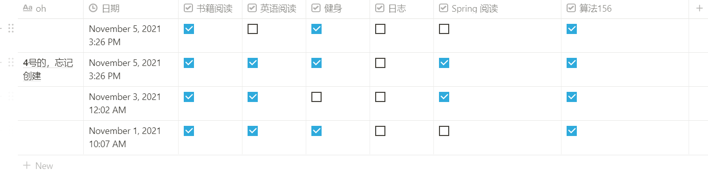

# 醒世名言：

坚持，成功取决于曾经挥洒的汗水。

千里之行始于足下。

# 反省

迷迷糊糊，十一月的半个月过去了。

总是执着于制定计划，执着于思考如何去做，真正行动的时长不够......

学习，没有教科书式的教程，东一榔头，西一棒槌式，涉猎广，深度不足。

## 打卡记录：

14 天：

实际打卡 记录只有 4天；

算法学习： 实际执行8天，完成6道题；

日志： 记录五天；

英语阅读： 实际坚持 3 天；

健身： 坚持三天；

# 思考

只有愿望，没有具体的执行路线是不行。

**没有路线图的愿望 == 空想**

没有具体的路线，就意味着 **此刻的你** 和 **目标**之间，充满了未知，充满了变数。

**打个比方**：

目标： 去面试

准备工作：

   第一步： 找到面试地点

**第二步**： 规划路线，比如打开高德地图，看看路线图；可能一天要去好几个地方，先去哪，再去哪，早上去哪，下午去哪。

执行：

  有路线图，按路线图去。  

如果没有做准备工作的第二步，执行的时候，就会遇到各种问题,包括： 时间，距离等等。规划好了，就可以知道先去哪里，再去哪里，几点去。

# 结果

贪多嚼不烂，从面出发，从点开始。 
一点一点累积优势，每天一分钟，每年365分钟，每天一小时，每年365小时，量变终会产生质变。